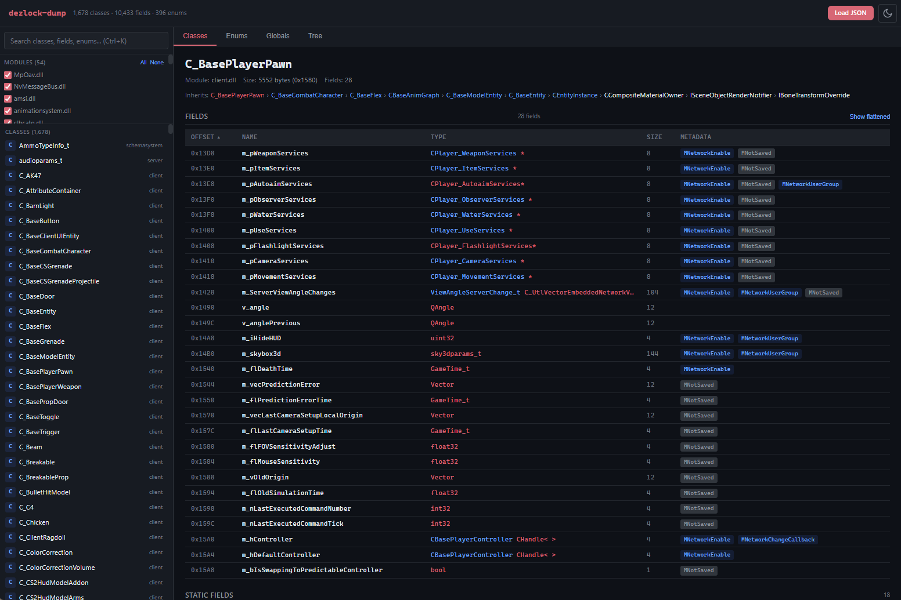

# dezlock-dump

[](../../releases/latest)
[](../../actions/workflows/build.yml)
[](https://discord.gg/sjcsVkE8ur)

Runtime schema + RTTI extraction tool for Source 2 games (Deadlock, CS2, Dota 2).



## What's New

**v1.5.0** — Interface scanner, string reference scanner, vtable member offset analyzer, and RTTI-only SDK struct headers for 9,000+ non-schema classes.

See the full [Changelog](CHANGELOG.md) for all releases.

## What

A single exe that injects a read-only worker DLL into a running Source 2 game and extracts the complete schema, RTTI, and runtime layout data — in seconds, with zero configuration. Built for educational purposes and reverse engineering research.

**One command, full extraction:**

```bash
dezlock-dump.exe --all
```

## How

1. Download from [Releases](../../releases) (or [build from source](#build-from-source))
2. Launch your game and load into a match or lobby
3. Run as administrator:

```bash
# Deadlock (default)
dezlock-dump.exe --all

# CS2
dezlock-dump.exe --process cs2.exe --all

# Dota 2
dezlock-dump.exe --process dota2.exe --all
```

Output lands in `schema-dump/<game>/` next to the exe.

| Flag | Default | Description |
|------|---------|-------------|
| `--process <name>` | `deadlock.exe` | Target process |
| `--output <dir>` | `schema-dump/<game>/` | Output directory |
| `--signatures` | off | Generate byte pattern signatures |
| `--sdk` | off | Generate cherry-pickable C++ SDK headers |
| `--layouts` | off | Analyze vtable functions for inferred member field offsets |
| `--all` | off | Enable all generators (sdk + signatures + layouts) |

> **Note:** Schema dump finishes in seconds. Signature generation (`--signatures` / `--all`) processes 800k+ functions and can take several minutes.

## Benefits

### Full SDK generation
Cherry-pickable C++ headers with v2-style types (`Vec3`, `QAngle`, `CHandle`), `constexpr` offsets, scoped enums, and `static_assert` validation on every field. Include only what you need — each class gets its own `.hpp`.

```cpp
#include "sdk/client/C_BaseEntity.hpp"
```

### Complete field offsets
Every class with every field — own and inherited — greppable in one file per module.

```
C_CitadelPlayerPawn.m_iHealth = 0x354 (int32, 4) [MNetworkEnable]
C_CitadelPlayerPawn.m_angEyeAngles = 0x11B0 (QAngle, 12)
```

### Entity access paths
Full recursive field trees with pointer chains resolved — grep any class and see the complete offset path to any nested field.

```
# C_CitadelPlayerPawn (size=0x1990)
  +0x10   m_pEntity                -> CEntityIdentity*
            +0x18   m_name                   (CUtlSymbolLarge)
  +0x354  m_iHealth                (int32, C_BaseEntity)
  +0x11B0 m_angEyeAngles           (QAngle)
```

### 10,000+ global singletons auto-discovered
Scans `.data` sections of every loaded module and cross-references against the RTTI vtable catalog. No hardcoded patterns needed.

```
client.dll::CCitadelCameraManager = 0x31F05F0 (static)
engine2.dll::CGameEntitySystem = 0x623AA8 (pointer)
```

### Pattern signatures for every virtual function
IDA-style byte patterns across 58+ DLLs — survive game patches where RVAs shift. Stubs detected, COMDAT deduplication handled, signatures trimmed to shortest unique prefix.

```
CCitadelInput::CreateMove = 48 89 5C 24 ? 55 48 8D AC 24
CSource2Client::idx_0 = 40 53 56 57 48 81
```

### RTTI layout headers
9,000+ non-schema classes get generated struct headers with inferred field offsets from vtable function analysis — no PDB required. Each field has type inference (`float`, `void*`, `uint32_t`, etc.) and access pattern annotations.

```cpp
#include "sdk/client/_rtti/CTraceFilter.hpp"
// namespace sdk::rtti — separate from schema structs
```

### Full RTTI inheritance
23,000+ classes with complete parent chains and vtable RVAs from MSVC x64 RTTI — including internal engine classes with no schema entry (CCitadelInput, CPanoramaUIEngine, CInputSystem, etc.).

### Runtime-scannable patterns in SDK
Global pointer patterns from `patterns.json` are exported as `_patterns.hpp` — drop them into your project and scan at runtime without hardcoded offsets. RIP-relative and derived patterns both supported.

```cpp
#include "sdk/_patterns.hpp"

// Scan at runtime — survives game patches
auto match = find_pattern(client_base, client_size, patterns::client::dwEntityList::sig);
auto addr = resolve_rip(match, patterns::client::dwEntityList::rip_offset);
```

### Supplementary pattern scanning
Optional `patterns.json` for untyped globals that vtable scanning can't find (`dwViewMatrix`, `dwEntityList`, etc.).

## Output Files

| File | Description |
|------|-------------|
| `<module>.txt` | Classes + flattened inherited fields + enums |
| `_globals.txt` | All global singletons with recursive field trees |
| `_access-paths.txt` | Schema globals only — fast offset grep |
| `_entity-paths.txt` | Every entity class with full field trees |
| `_all-modules.json` | Complete structured JSON export |
| `signatures/<module>.txt` | Pattern signatures per module |
| `sdk/<Class>.hpp` | Per-class C++ SDK headers |
| `sdk/_all-offsets.hpp` | All offset constants |
| `sdk/_all-enums.hpp` | All scoped enums |
| `sdk/_all-vtables.hpp` | VTable RVAs + function indices |
| `sdk/_globals.hpp` | Resolved global pointer RVAs |
| `sdk/_patterns.hpp` | Runtime-scannable byte patterns for globals |
| `sdk/_rtti-layouts.hpp` | Master include for all RTTI layout headers |
| `sdk/<module>/_rtti/<Class>.hpp` | Per-class RTTI-inferred struct headers |
| `viewer/index.html` | Interactive browser-based viewer for `_all-modules.json` |

## Interactive Viewer

A browser-based viewer for exploring dump output interactively. Open `viewer/index.html` in any browser — no server, no build step, no dependencies.

1. Open `viewer/index.html` directly from your filesystem
2. Drop your `_all-modules.json` onto the landing page (or use the file picker)
3. Browse classes, fields, enums, globals, and inheritance trees

**Features:**
- Searchable class/field/enum browser with module filtering (Ctrl+K to focus)
- Sortable field offset tables with own/flattened inherited field toggle
- Clickable inheritance chains — click any parent class to navigate
- Global singletons browser with module grouping and pattern globals
- Full inheritance tree with collapsible nodes
- Dark/light theme toggle
- Works offline with 150MB+ JSON files (parses in a Web Worker)

## Build from Source

Requires Visual Studio 2022 with C++ desktop workload and CMake 3.20+ (ships with VS2022).

```bash
cmake -B build -G "Visual Studio 17 2022" -A x64
cmake --build build --config Release
```

Or just run `build.bat`. Output lands in `build/bin/Release/`.

## Requirements

- Windows 10/11 (x64)
- Target Source 2 game running with `client.dll` loaded
- Run as **administrator**

## Contributing

Open an [issue](../../issues) or submit a [pull request](../../pulls). Join the [Discord](https://discord.gg/sjcsVkE8ur) for questions and discussion.

---

If you find this tool useful, consider giving it a star.
