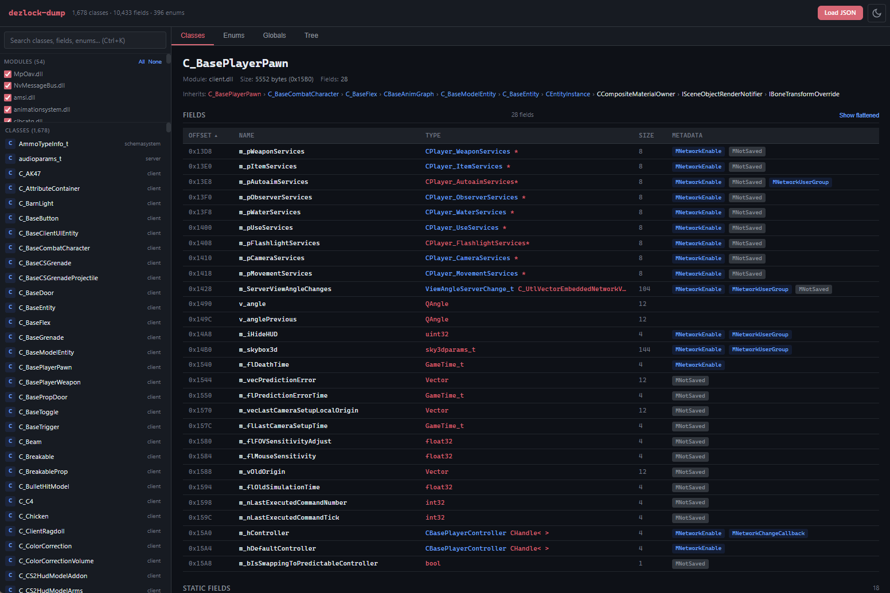

# dezlock-dump

[](../../releases/latest)
[](../../actions/workflows/build.yml)
[](https://discord.gg/sjcsVkE8ur)
[](mailto:hello@withseismic.com)

Extracts everything from a running Source 2 game (Deadlock, CS2, Dota 2) and generates a **patch-proof C++ SDK** that resolves offsets at runtime. No hardcoded values, no manual updates when the game patches.



[](https://www.youtube.com/watch?v=fz-JlwcnIfY)

## Quick Start

1. Download from [Releases](../../releases) (or [build from source](#build-from-source))
2. Launch your game — load into a match or lobby
3. Run as administrator:

```bash
dezlock-dump.exe
```

That's it. Auto-detects the game, dumps everything, generates the full SDK. Output lands in `schema-dump/<game>/` next to the exe.

```bash
# Target a specific game
dezlock-dump.exe --process cs2.exe

# Live mode — starts a WebSocket server for real-time entity inspection
dezlock-dump.exe --live
```

## What You Get

### Runtime-Resolved SDK (the main thing)

Drop-in C++ headers for your injected DLL. Fields and virtual functions resolve at runtime from the game's own SchemaSystem — your compiled DLL survives game patches without rebuilding.

```cpp
#include "internal-sdk/client/entities/C_BaseEntity.hpp"

sdk::C_BaseEntity* ent = /* from entity list */;

// Fields — resolved at runtime, cached after first call
int hp       = ent->m_iHealth();
uint8_t team = ent->m_iTeamNum();
bool alive   = ent->is_alive();

// Virtual functions — call through vtable by index
int max_hp   = ent->GetMaxHealth();     // VFUNC(163, int32_t, GetMaxHealth)
```

**2,400+ structs** including all game-specific VData (abilities, items, weapons, modifiers), **229 entity classes**, and **1,766 classes with virtual function wrappers**.

### Everything Else

| Output | What |
|--------|------|
| `internal-sdk/` | Runtime-resolved C++ headers (entities, structs, enums, VData) |
| `sdk/` | Static SDK with `constexpr` offsets (breaks on patches, useful as reference) |
| `signatures/` | IDA-style byte patterns for every vtable function across 58+ DLLs |
| `_globals.txt` | 10,000+ auto-discovered global singletons with field trees |
| `_protobuf-messages.txt` | Decoded `.proto` definitions embedded in game binaries |
| `_all-modules.json` | Complete structured JSON export — feed it to the viewer or your own tools |

## SDK Macros

```cpp
struct C_BaseEntity : CEntityInstance {
    SCHEMA_CLASS("client.dll", "C_BaseEntity");

    FIELD(m_iHealth, int32_t);              // runtime-resolved field
    FIELD_PTR(m_pGameSceneNode, void*);     // pointer dereference
    FIELD_ARRAY(m_nCurrencies, int32_t, 6); // fixed-size array
    FIELD_BLOB(m_Particles, 40);            // opaque bytes

    VFUNC(146, int32_t, GetHealth);         // named virtual call
    VFUNC_ARGS(42, void, SetModel, const char*); // with arguments
    VFUNC_RAW(53);                          // unnamed, with signature hint
};
```

Virtual function names are discovered automatically from the binary — debug string xrefs, member access inference, and protobuf descriptors. No manual config.

## Interactive Viewer

```bash
cd viewer && pnpm install && pnpm dev
```

Drop your `_all-modules.json` onto the page, or connect live to a running dump (`--live` flag). Searchable class/field/enum browser, live entity inspector, clickable inheritance chains, global singletons, protobuf messages.

## Build from Source

Requires Visual Studio 2022 with C++ desktop workload.

```bash
cmake -B build -G "Visual Studio 17 2022" -A x64
cmake --build build --config Release
```

## CLI Reference

| Flag | Description |
|------|-------------|
| `--process <name>` | Target process (default: auto-detect) |
| `--output <dir>` | Output directory (default: `schema-dump/<game>/`) |
| `--live` | Start WebSocket server on `:9100` for real-time inspection |
| `--schema <path>` | Load existing JSON dump instead of injecting |
| `--internal-sdk` | Only generate runtime SDK |
| `--sdk` | Only generate static SDK |
| `--signatures` | Only generate byte patterns |
| `--layouts` | Only generate member layouts |

No flags = generate everything.

## Technical Deep-Dives

- [How Source 2's SchemaSystem Works Internally](docs/how-source2-schema-system-works.md)
- [Building an MSVC x64 RTTI Scanner from Scratch](docs/building-msvc-x64-rtti-scanner.md)
- [Manual DLL Mapping: How and Why We Skip LoadLibrary](docs/manual-dll-mapping-explained.md)
- [Auto-Discovering 10,000+ Global Singletons](docs/auto-discovering-global-singletons.md)
- [Building an Interactive Binary Analysis Viewer](docs/building-a-binary-analysis-viewer.md)

## Disclaimer

Educational and research purposes only. Read-only memory inspection — no game modification, no competitive advantage. Use at your own risk; may violate target application ToS. Extracted data remains the IP of its respective owners.

## Contributing

[Issues](../../issues) | [Pull requests](../../pulls) | [Discord](https://discord.gg/sjcsVkE8ur)
